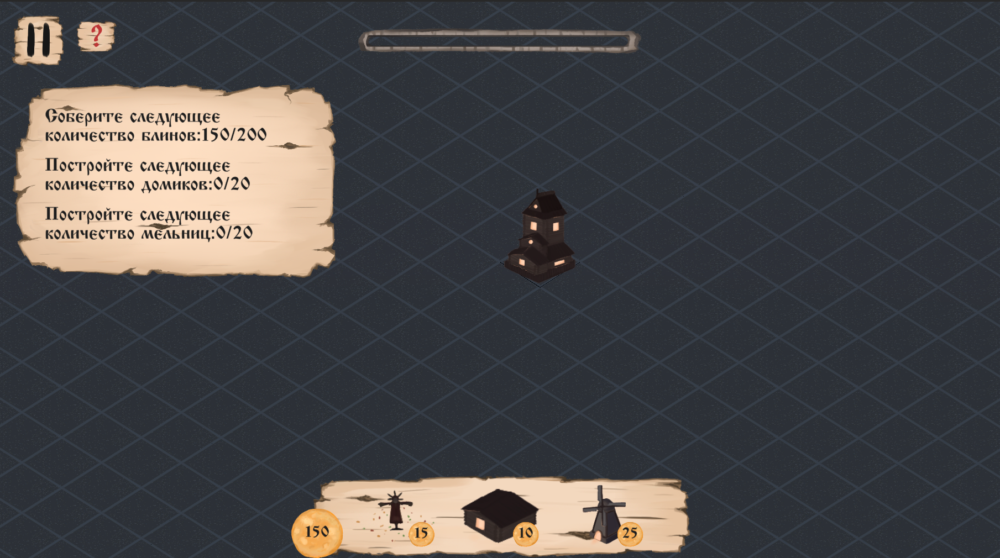

# Light Bonfires

# Зажечь костры!
Накануне Масленицы над тридевятым королевством наступила вечная мрачная ночь. Тёмные силы не дремлют:  маленькая деревушка  пытается выжить от наступающей вокруг тьмы...

Задача игрока: спасти деревушку от темных сил и дожить до утра, чтобы сжечь Масленицу. Каждое строение убавляет шкалу тёмных сил (мельница же генерирует основную игровую валюту - блинчики).

Пеки блины и спасай тридевятое королевство!

Игра была разработана во время участия в Indie Varvar's Jam #4